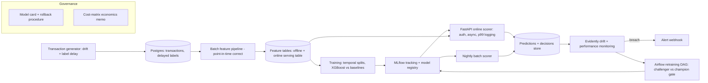

# Architecture

The system turns a stream of card transactions — with fraud labels that arrive
weeks late — into fast, explained, monitored fraud decisions, and keeps itself
honest with drift detection and automated retraining.

## The flow in words

1. **Generate** a realistic, defect-rich transaction stream with late labels and a
   fraud ring that appears partway through (the drift the monitor must catch).
2. **Land** it in Postgres, transactions and late-arriving labels kept separate.
3. **Engineer features** point-in-time correctly — never using information that
   wouldn't have existed at the moment of the transaction.
4. **Train** on temporal splits (never random splits — see the ADR), comparing an
   honest baseline against XGBoost, with every run tracked in MLflow.
5. **Decide** using a cost matrix: thresholds are set to minimize expected dollar
   loss per segment, not to maximize a classification score.
6. **Serve** two ways from one registered model — a live API and a nightly batch —
   proven consistent by a parity test.
7. **Monitor** input and score-distribution drift (you can't monitor the target —
   the labels aren't here yet), and **retrain** automatically when a challenger
   beats a degraded champion through a promotion gate.

Each numbered step is a milestone; see `../CHANGELOG.md` for progress.
