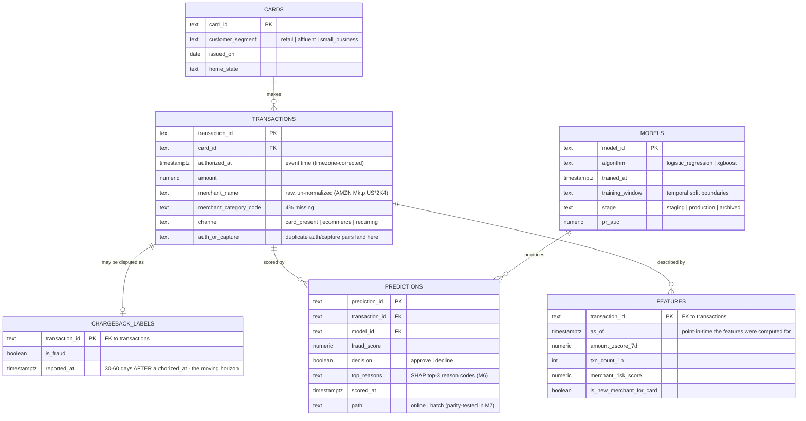

# Entity-Relationship Diagram — Fraud Warehouse

This is the schema **designed at Milestone 1**, before any data exists. Designing
the schema is itself the skill; the tables below anticipate what every later
milestone needs, so the structure doesn't get rebuilt mid-project.

The single most important design choice is that **labels are separated from
transactions**. A fraud label (chargeback) arrives 30–60 days *after* the
transaction. Modeling that as a nullable column on `transactions` would quietly
invite leakage — you'd be tempted to train on labels that, on the transaction
date, did not yet exist. A separate `chargeback_labels` table with its own
`reported_at` timestamp forces every feature and every training split to respect
the "what did we know, and when did we know it" boundary.

## Why each table exists

- **cards** — the customer dimension; `customer_segment` drives per-segment
  thresholds in the decision layer (M5), because the cost of a false decline
  differs by segment.
- **transactions** — the raw event stream, landed faithfully with its defects
  (missing MCCs, chaotic merchant names, duplicate auth/capture pairs) so cleaning
  is a documented, tested step rather than a silent one.
- **chargeback_labels** — separated precisely because labels are late; `reported_at`
  is what makes point-in-time-correct training possible.
- **features** — computed as-of a point in time; `as_of` is the guardrail against
  using the future to predict the past.
- **models** — the registry metadata mirror of what MLflow tracks; `stage` carries
  the champion/challenger promotion state (M9).
- **predictions** — every score, from either serving path, with reason codes; `path`
  lets the M7 parity test prove online and batch agree.
